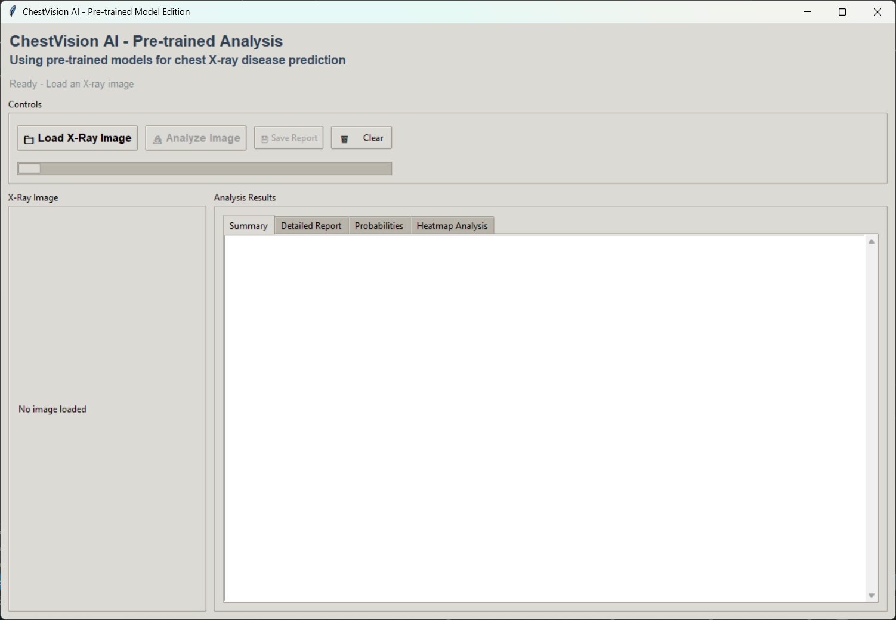
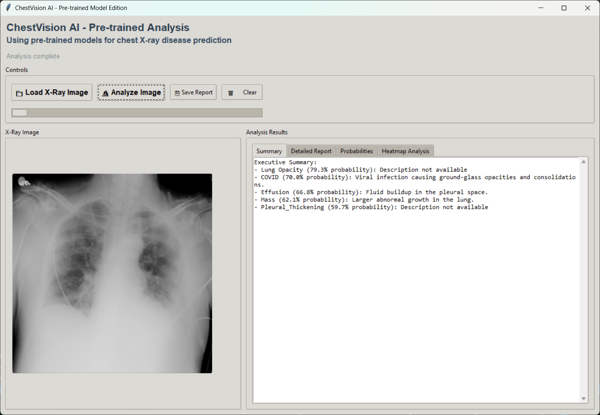
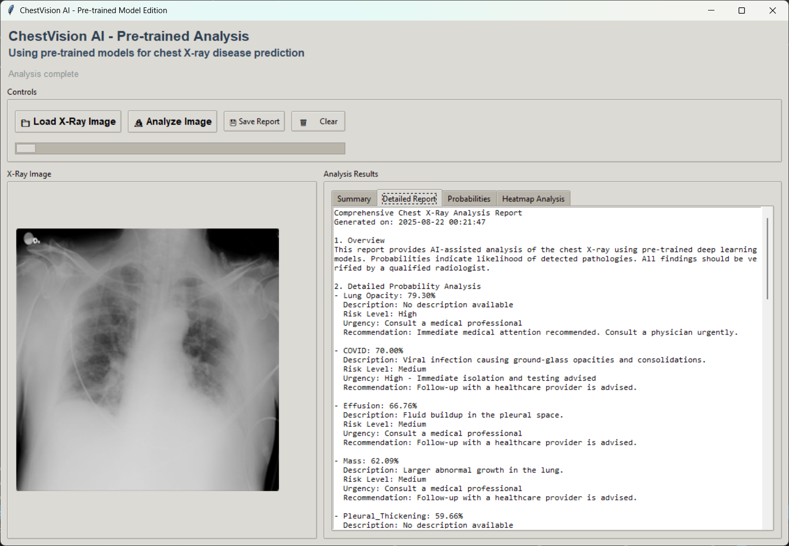
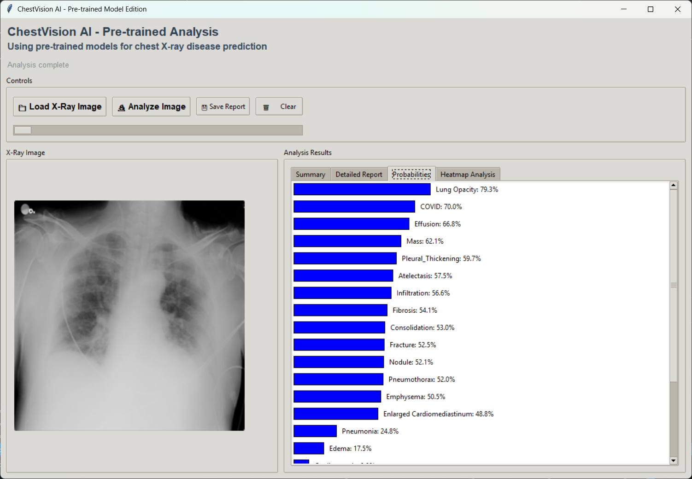
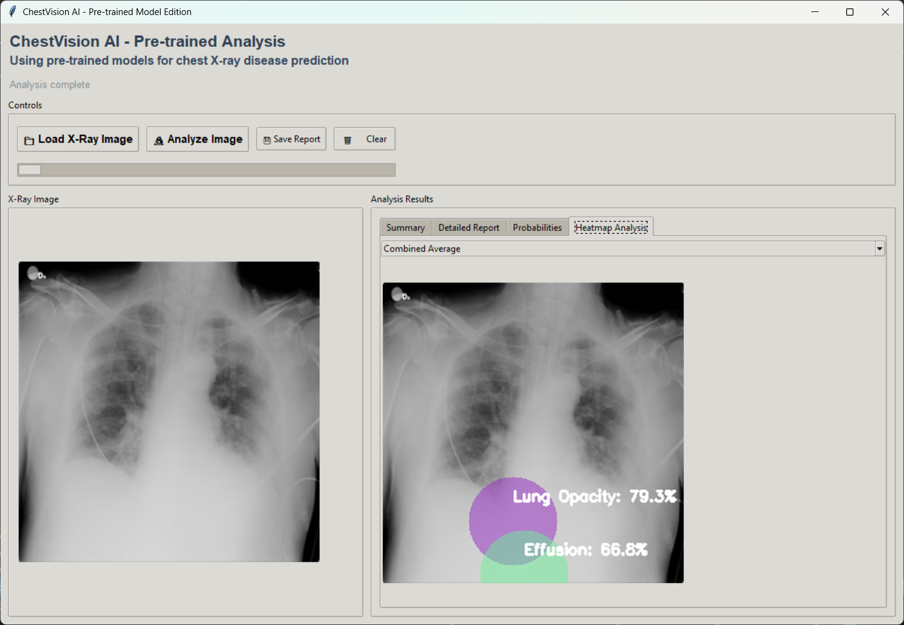

# ChestXRay AI Diagnostic System 🏥

[](https://www.python.org/downloads/)
[](https://pytorch.org/)
[](LICENSE)

An advanced medical imaging analysis application that leverages state-of-the-art deep learning models to provide comprehensive chest X-ray diagnostics. This system combines multiple pre-trained models to detect various chest conditions with high accuracy, providing medical professionals with detailed analysis, visual heatmaps, and comprehensive reports.

## 🌟 Key Features

- **Multi-Disease Detection**: Simultaneous detection of 18 different chest conditions including pneumonia, COVID-19, tuberculosis, and various other pathologies
- **Emergency Alert System**: Automatic identification and flagging of critical conditions requiring immediate medical attention
- **Visual Heatmap Analysis**: Advanced visualization showing areas of concern with disease-specific and combined heatmaps
- **Comprehensive Medical Reports**: Professional PDF reports with detailed findings, recommendations, and emergency alerts
- **Pre-trained Model Ensemble**: Utilizes multiple validated models trained on large-scale datasets (NIH, CheXpert, MIMIC-CXR)
- **User-Friendly Interface**: Intuitive GUI designed for medical professionals

## 📸 Screenshots

### Main Interface

*Clean and intuitive main interface for loading and analyzing X-ray images*

### Analysis Summary

*Quick summary view showing detected conditions and confidence levels*

### Detailed Medical Report

*Comprehensive medical report with findings and recommendations*

### Disease Probability Visualization

*Visual representation of disease detection probabilities*

### Heatmap Analysis

*Advanced heatmap showing areas of concern in the X-ray image*

## 🚀 Quick Start

### Prerequisites

- Python 3.8 or higher
- CUDA-capable GPU (recommended for faster processing)
- 8GB+ RAM
- 2GB+ free disk space for models

### Installation

1. **Clone the repository**
```bash
git clone https://github.com/yourusername/ChestXRay-AI-Diagnostic-System.git
cd ChestXRay-AI-Diagnostic-System
```

2. **Create a virtual environment** (recommended)
```bash
python -m venv venv
# On Windows
venv\Scripts\activate
# On macOS/Linux
source venv/bin/activate
```

3. **Install dependencies**
```bash
pip install -r requirements.txt
```

4. **Download pre-trained models**
The application will automatically download required models on first run. Ensure you have a stable internet connection.

### Running the Application

```bash
python main.py
```

## 💡 Usage Guide

1. **Launch the Application**: Run `python main.py` to start the GUI
2. **Load X-Ray Image**: Click "Load X-Ray Image" and select a chest X-ray image (JPG, PNG formats supported)
3. **Analyze**: Click "Analyze Image" to process the X-ray
4. **Review Results**: 
   - Check the Summary tab for quick findings
   - View Detailed Report for comprehensive analysis
   - Explore Probabilities tab for confidence scores
   - Examine Heatmap Analysis for visual insights
5. **Save Report**: Click "Save Report" to generate a professional PDF report

## 🏗️ Project Structure

```
ChestXRay-AI-Diagnostic-System/
│
├── ai/                              # AI models and processing
│   ├── model_manager.py            # Model loading and management
│   ├── report_generator.py         # Report generation logic
│   ├── heatmap_generator.py        # Heatmap visualization
│   └── medical_report_generator.py # PDF report generation
│
├── gui/                            # User interface
│   └── main_window.py             # Main GUI implementation
│
├── already_trained_model/          # Pre-trained model files
│   ├── densenet.hdf5              # DenseNet model weights
│   └── *.pth                      # Various PyTorch model files
│
├── docs/                          # Documentation
│   └── screenshots/               # Application screenshots
│
├── config/                        # Configuration files
│   └── app_config.yaml           # Application settings
│
├── main.py                       # Application entry point
├── requirements.txt              # Python dependencies
└── sample_diagnostic_report.pdf # Example output report
```

## 🔬 Detected Conditions

The system can detect and analyze the following chest conditions:

- **Atelectasis** - Partial or complete lung collapse
- **Cardiomegaly** - Enlarged heart
- **Consolidation** - Lung tissue filled with liquid
- **Edema** - Fluid accumulation in lungs
- **Effusion** - Fluid in pleural space
- **Emphysema** - Damaged air sacs in lungs
- **Fibrosis** - Scarred lung tissue
- **Hernia** - Organ displacement
- **Infiltration** - Substance accumulation in lungs
- **Mass** - Abnormal tissue growth
- **Nodule** - Small round growth
- **Pleural Thickening** - Thickened lung lining
- **Pneumonia** - Lung infection
- **Pneumothorax** - Collapsed lung
- **COVID-19** - Coronavirus disease patterns
- **Lung Opacity** - Unclear lung areas
- **Enlarged Cardiomediastinum** - Enlarged heart/central chest
- **Fracture** - Bone breaks

## 📊 Model Information

The application uses ensemble learning with multiple pre-trained models:

- **DenseNet-121**: Trained on NIH ChestX-ray14 dataset (112,120 images)
- **ResNet-50**: Enhanced architecture for high-resolution analysis
- **TorchXRayVision Models**: State-of-the-art models from leading research

These models have been validated on multiple datasets including:
- NIH ChestX-ray14
- CheXpert
- MIMIC-CXR
- PadChest
- RSNA Pneumonia Dataset

## ⚠️ Medical Disclaimer

**IMPORTANT**: This software is intended for research and educational purposes only. It should NOT be used as the sole basis for medical diagnosis or treatment decisions. Key points:

- This is an AI-assisted diagnostic tool, not a replacement for professional medical judgment
- All results should be reviewed and validated by qualified medical professionals
- The system may produce false positives or false negatives
- Always consult with healthcare providers for medical decisions
- Emergency cases should be immediately referred to appropriate medical facilities

## 🛠️ Technical Requirements

### Minimum Requirements
- **OS**: Windows 10/11, macOS 10.14+, or Linux (Ubuntu 18.04+)
- **RAM**: 8GB
- **Storage**: 2GB free space
- **Python**: 3.8+
- **Display**: 1280x720 resolution

### Recommended Requirements
- **RAM**: 16GB+
- **GPU**: NVIDIA GPU with CUDA support
- **Storage**: 5GB free space
- **Display**: 1920x1080 resolution

## 🤝 Contributing

We welcome contributions to improve the ChestXRay AI Diagnostic System! Please see our [Contributing Guidelines](CONTRIBUTING.md) for details on:

- Code of Conduct
- Development setup
- Submitting pull requests
- Reporting issues

## 📝 License

This project is licensed under the MIT License - see the [LICENSE](LICENSE) file for details.

## 🙏 Acknowledgments

- TorchXRayVision team for pre-trained models
- NIH Clinical Center for the ChestX-ray14 dataset
- Stanford ML Group for CheXpert dataset
- MIT for MIMIC-CXR dataset
- All researchers and institutions contributing to open medical AI research


## 🔄 Version History

- **v1.0.0** (2024-08) - Initial release
  - Multi-disease detection
  - Emergency alert system
  - PDF report generation
  - Heatmap visualization

---

**Note**: This application represents ongoing research in medical AI. We continuously work to improve accuracy and add new features based on the latest research and user feedback.
